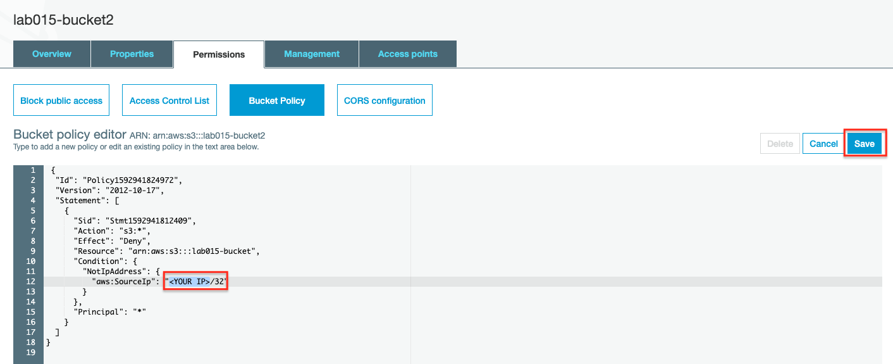

# hands-on-015

## An S3 Bucket Accessed via AWS CLI + Resource Policy


## Goal
This hands-on is similar to [hands-on-013](../hands-on-013). However, we will be creating a resource-based policy to only allow access to the bucket if requests are sent from a specific IP address.

## Overview

Repeat steps 1 and 2 of [hands-on-013](../hands-on-013), changing the name of the bucket to *hands-on015-bucket*.

### Step 1 - Create a Resource-based Policy

Because the policy we want to create is based on the IP of the computer we will be using to access the s3 bucket, use [whatismyip.com](https://www.whatismyip.com/) to determine what is your computer's current IP.

An easy way to create a policy is to use the [AWS Policy Generator](https://awspolicygen.s3.amazonaws.com/policygen.html) tool.  Use this [policy](files/policy.json) as an example. Don't forget to replace *YOUR IP* with your client computer's IP address.

### Step 2 - Apply Policy to Bucket



## Test and Validation

Verify that with the policy you are able to have full access to the s3 bucket. Try changing the IP address of the policy (or accessing it from a computer with a different public IP) and verify that access is denied after that.

In order to be able to regain access to the bucket you need to use the root credential to remove the policy.  Use the following command to do so (must use root's credentials):

```
aws s3api delete-bucket-policy --bucket hands-on015-bucket
```
