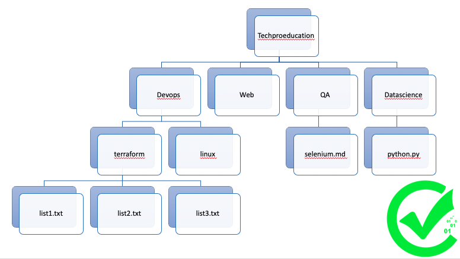



# Linux LAB - 1

## Subject: Linux Basic Shell Commands
---

1. Open the terminal

```bash

```
2. To know which directory you are in, you can use the `pwd` command. 

```bash

```

3. Create a directory named `Techproeducation` in user's home directory.
```bash

```
4. Go into `Techproeducation` directory.
```bash

```
5. List all the files/folders with details in `Techproeducation` directory.

```bash

```
6. Create folders named `Devops`, `Web`, `QA` and `Datascience`.

```bash

```

7. Go into `Devops` directory and list content of the directory with details and hidden files.

```bash

```

8. Create folders named `terraform` and `linux` after that list the content of `Devops`.

```bash

```

9. Go into `Web` directory and list content of `Devops` directory with details and hidden files.

```bash

```

10. Print and check the path of the directory you are in.

```bash

```

11. Create 3 files named "list1.txt", "list2.txt", "list3.txt" inside `terraform`.

```bash

```

12. Write into the `list1.txt` informations using "echo" command according to the text given below.


    `Est sint irure est do do proident fugiat qui consectetur non velit adipisicing sunt do. Reprehenderit ad minim id dolore cupidatat velit esse laborum sit qui esse. Amet veniam fugiat ex in reprehenderit ullamco elit sint voluptate cupidatat cillum id commodo amet. Mollit irure pariatur non eiusmod mollit irure veniam. Sint proident mollit nostrud aute nisi tempor aliqua minim qui ad Lorem. Minim incididunt veniam dolor amet laborum velit ut exercitation.`


13. Create a file named `selenim.md` in `QA` folder with `touch`command.

```bash

```

14. W into the `selenium.md` file using `cat` command according to the text given below.

    `Est sint irure est do do proident fugiat qui consectetur non velit adipisicing sunt do.`


15. Create a file named `python.py` in `Datascience` folder with `touch`command.

```bash

```

16. Write into the `python.py` file using `cat` command according to the text given below.

```py
print ("Hello")
```

17. List the content of `Datascience` directories with details and hidden files.

```bash

```

18. Go into `Devops` directory from inside `QA`  directory and list  
content of `QA` directory with details and hidden files.

```bash

```

19. List the content of `Devops` directory.

```bash

```


20. Go into `Techproeducation` directory.

```bash

```

21. Install "tree" command via packet manager. Reqired code is below.

- For Ubuntu:
```bash
sudo apt update
sudo apt install tree
```

22. Run the command `tree` and save the output and all the history you have done in a `name_surname.txt` and send to your mentor.

---
`Thank you all...`

