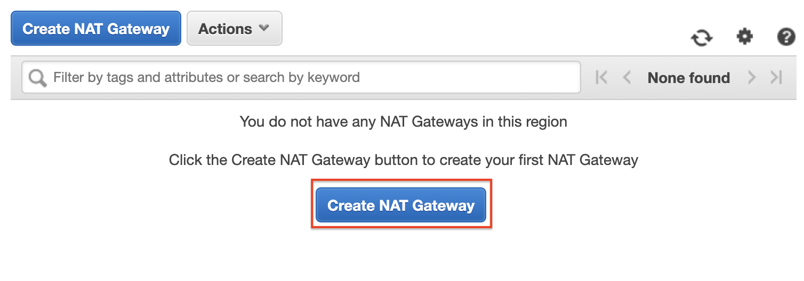
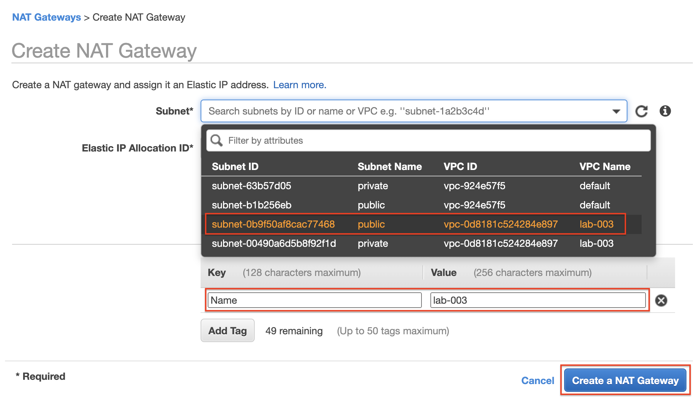
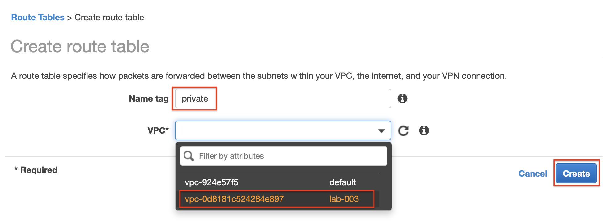
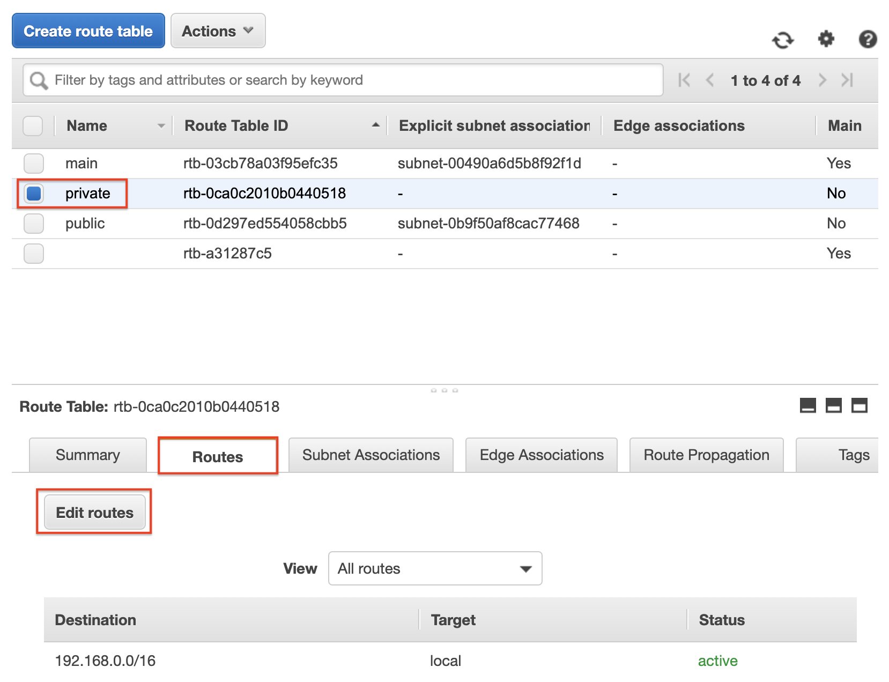
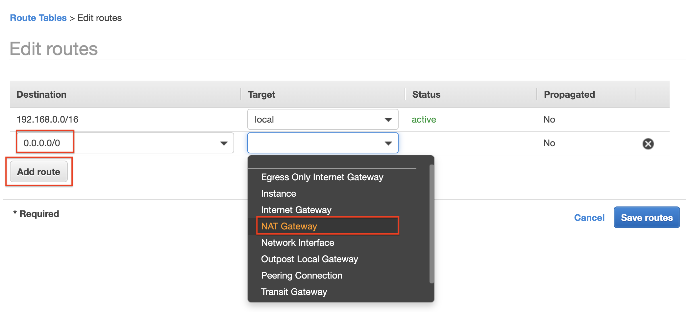
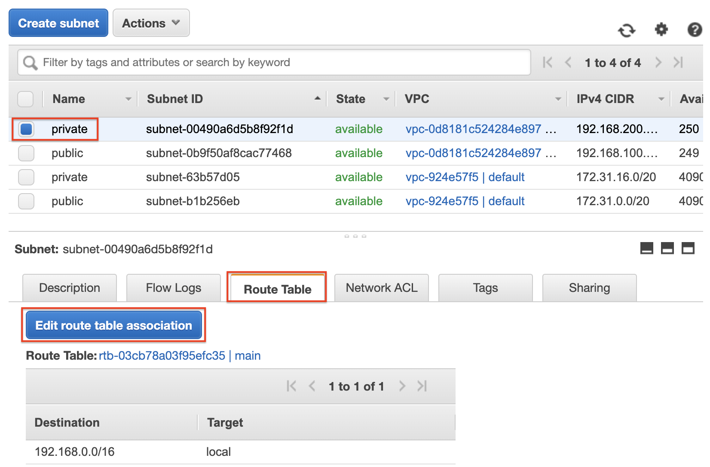
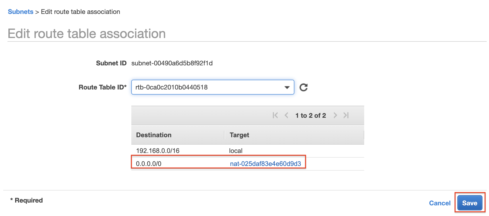

# hands-on-003

## A Single EC2 Instance in a Private Subnet + Bastion Host + NAT Gateway


## Goal
This hands-on illustrates how an EC2 instance running in a *private* subnet can be configured to access the internet with the help of a service called [Nat gateway](https://docs.aws.amazon.com/vpc/latest/userguide/vpc-nat-gateway.html).

## Architecture Diagram


## Overview

In order to achieve the goal of this hands-on, you will have to go through the following steps:

### Step 1 - Run hands-on-002
Repeat all of the steps described in [hands-on-002](../hands-on-002), making sure that any reference to hands-on-002 are replaced by hands-on-003.

### Step 2 - Create a NAT Gateway
Create a [NAT gateway](https://docs.aws.amazon.com/vpc/latest/userguide/vpc-nat-gateway.html) in the public subnet. Note that an elastic public IP must be allocated before a NAT gateway can be created.  





### Step 3 - Create a Route Table
Create a new route table with the *Name tag* private and with a default route to the NAT gateway created in step 2.








### Step 4 - Associate the Route Table to the Private Subnet
Associate the newly created route table to the private subnet.






## Test and Validation
To validate this hands-on you need to access the EC2 instance in the private subnet (hands-oneled as B) and from there try to access the internet, for example:

```
curl www.google.com
```
