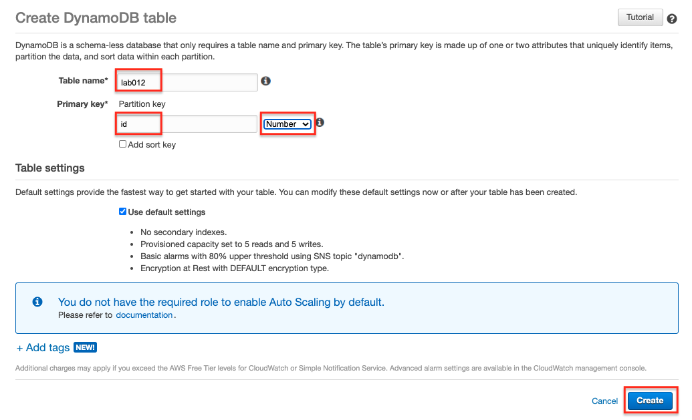
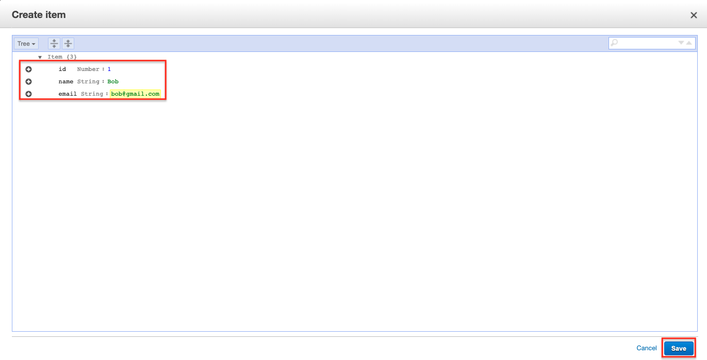
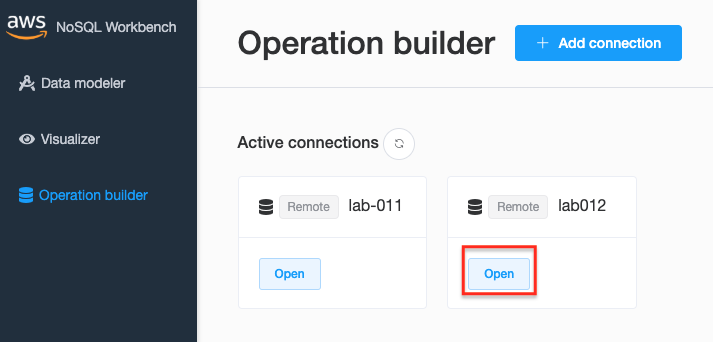
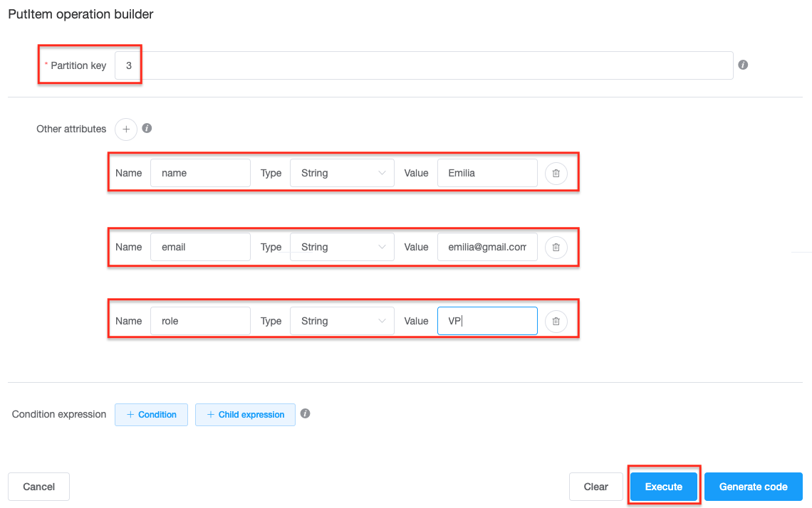

# hands-on-012

## A Simple Dynamodb Service

## Goal

This hands-on illustrates how to create and remotely access a dynamodb table.  Dynamodb is a NoSQL managed database service.   

## Overview

### Step 1 - Create a Dynamodb Table

Go to Database - Dynamodb service and click on *Create table*.  

### Step 2 - Create and Download an Access Key

Go to IAM - Users and then select your user. Then go to *Security credentials* and create an access key. Download the key you created (a csv file) and use it on the next step.

### Step 3 - Connect to Dynamodb Table

Download and install [NoSQL Workbench](https://docs.aws.amazon.com/amazondynamodb/latest/developerguide/workbench.settingup.html).  Follow the steps to connect to your dynamodb table.

## Test and Validation

After you connect, try to visualize the contents of the table and modify it.

