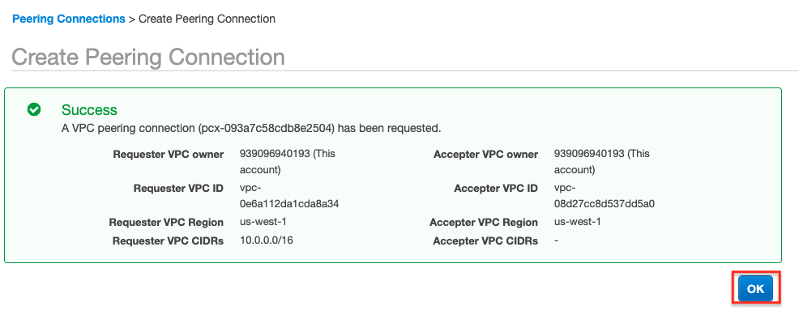
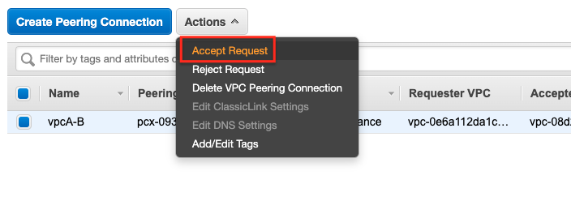

# hands-on-021

## VPC Peering


## Goal

The goal of this hands-on is to illustrate a VPC peering connection, a way to connect two VPCs using a private connection.

## Architecture Diagram



## Overview

Once the VPCs and subnets are created, the internet gateway and the EC2 instances are launched and configured, follow the steps described next.

### Step 1 - Create the Peering Connection





### Step 2 - Accept the Peering Connection






### Step 3 - Modify Route Tables

First on the VPC A side:



Then on the VPC B side:



To test the setting, first ssh to the EC2 instance A (the one on VCP A).  Then try to ssh to EC2 instance B (the on on VPC B) using its private IP address.
