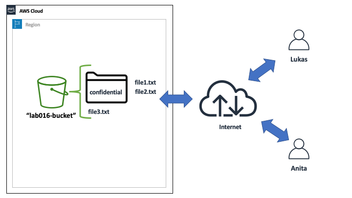

# hands-on-016

## An S3 Bucket + Identity-based Policies

## Goal

The goal of this hands-on is to demonstrate how to create identity-based polices on an s3 bucket.

## Architecture Diagram

## Overview

Identity-base polices, as the name suggests, are policies that can be attached to identities (users, groups, or roles). In the scenario for this hands-on there is an s3 bucket named *hands-on016-bucket* that needs to be shared among two users: *Lukas* and *Anita*. User *Anita* should not have access to the *confidential* folder.

Repeat steps 1 and 2 of [hands-on-013](../hands-on-013), changing the name of the bucket to *hands-on016-bucket*. The bucket's ARN (Amazon Resource Name) should be: *arn:aws:s3:::hands-on016-bucket*. Create a folder called *confidential* and upload the following files using the console:

* [file1.txt](files/file1.txt) (uploaded to the *confidential* folder),
* [file2.txt](files/file2.txt) (uploaded to the *confidential* folder), and
* [file3.txt](files/file3.txt).

### Step 1 - Create Identity-based Policies

To create a policy go to IAM - Policies - Create policy.

#### Step 1.1 - hands-on016BucketAllowAccess

If an identify has this policy it will have full access to the *hands-on016-bucket* s3 bucket. To create this policy you can use the [AWS Policy Generator](https://awspolicygen.s3.amazonaws.com/policygen.html) tool or just copy the [hands-on016BucketAllowAccess](files/hands-on016BucketAllowAccess.json) file.

#### Step 1.2 - hands-on016BucketConfidentialFolderDenyAccess

If an identify has this policy it will be denied access to folder *confidential*  *hands-on016-bucket* s3 bucket. To create this policy you can use the [AWS Policy Generator](https://awspolicygen.s3.amazonaws.com/policygen.html) tool or just copy the [hands-on016BucketAllowAccess](files/hands-on016BucketAllowAccess.json) file.

### Step 2 - Create User Identities

To create a user go to IAM - Users - Add user.

#### Step 2.1 - Create User Lukas

Note that only the *hands-on016BucketAllowAccess* policy is attached to user Lukas. Also, make sure to download the credentials for each user and configure an AWS CLI [named profile](https://docs.aws.amazon.com/cli/latest/userguide/cli-configure-profiles.html).

#### Step 2.2 - Create User Anita

Note that both policies, *hands-on016BucketAllowAccess* and *hands-on016BucketConfidentialFolderDenyAccess*, are attached to user Anita.

## Test and Validation
Provide some guidance on how to test the hands-on and validate whether it is doing what is suppose to do.
